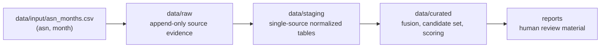
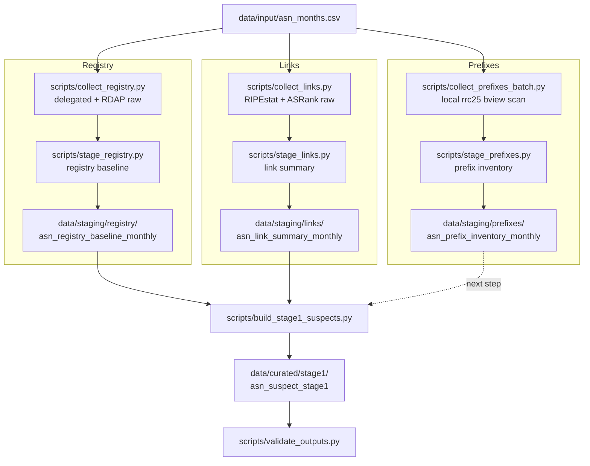
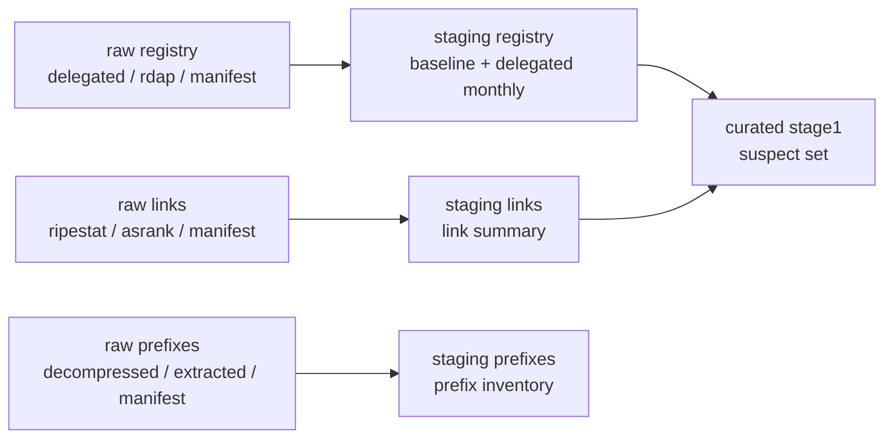
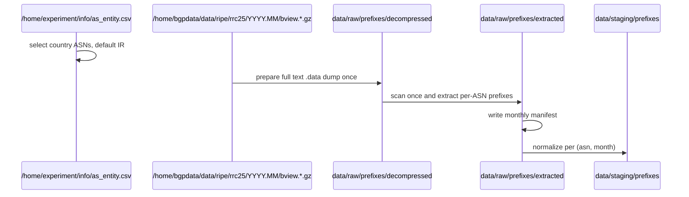
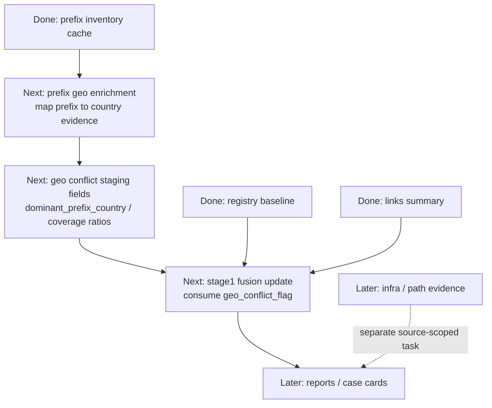

# 项目流程

状态：archived

归档原因：当前执行入口已拆分为 `docs/runbook.md`，当前状态为 `docs/status.md`，长期路线为 `docs/roadmap.md`。本文只作为早期工程地图背景参考。

最后更新：2026-04-29

本文档是当前工作区的工程地图。它回答三个问题：

- 已经构建了什么？
- 数据如何在流水线中流转？
- 下一步应该做什么？

分析单元仍然是 `(asn, month)`。自动输出仅为候选集和审查材料，而非最终判断。

## 1. 分层模型



分层规则：

- `raw`：收集并保存证据，获取状态、时间戳、源元数据、哈希值。
- `staging`：仅对单一来源进行规范化。不进行跨源融合，不进行最终评分。
- `curated`：合并多个来源，构建第一阶段候选集，添加评分或标签建议。
- `reports`：生成案例卡片、摘要和人工审查材料。

## 2. 当前流水线地图



重要边界：`prefixes` 目前是一个已暂存的单源缓存。它尚未作为地理冲突信号融合到第一阶段中。

## 3. 来源状态

| 来源 | 采集器 | 暂存脚本 | 当前状态 | 主要输出 |
|---|---|---|---|---|
| Registry | `scripts/collect_registry.py --online` | `scripts/stage_registry.py` | 已实现真实的 delegated + RDAP 采集 | `data/staging/registry/asn_registry_baseline_monthly.csv` |
| Links | `scripts/collect_links.py --online` | `scripts/stage_links.py` | 已实现真实的 RIPEstat + CAIDA ASRank 采集 | `data/staging/links/asn_link_summary_monthly.csv` |
| Prefixes | `scripts/collect_prefixes_batch.py` | `scripts/stage_prefixes.py` | 本地 `rrc25` bview 批量缓存已实现，并有完整的 IR 2026-03 运行记录 | `data/staging/prefixes/asn_prefix_inventory_monthly.csv` |
| Stage1 | `scripts/build_stage1_suspects.py` | n/a | 已实现注册信息 + 连接的融合；前缀地理信息尚未融合 | `data/curated/stage1/asn_suspect_stage1.csv` |
| Registry region changes | `scripts/analyze_asn_region_changes.py` | n/a | Delegated 月度历史分析作为独立的注册信息分析路径存在 | `data/curated/registry/asn_region_change_events.csv` |

## 4. 当前制品



观察到的本地状态：

- `data/staging/registry/asn_registry_baseline_monthly.csv` 存在。
- `data/staging/links/asn_link_summary_monthly.csv` 存在。
- `data/curated/stage1/asn_suspect_stage1.csv` 存在。
- `data/staging/prefixes/asn_prefix_inventory_monthly.csv` 存在。
- `2026-03` 的完整 IR 前缀批量处理写入了 `822` 条原始提取记录和 `822` 行暂存记录。
- 该批量处理复用了已解压的本地转储文件 `data/raw/prefixes/decompressed/rrc25/2026.03/bview.20260331.1600.data`。
- 批量处理日志为 `data/raw/_logs/patent_ir_prefix_202603_b4.log`。

## 5. 前缀批量处理流程

当前前缀路由的设计旨在避免为每个查询重复扫描同一大型 bview 文件。



当前完整运行命令：

```bash
screen -dmS patent_ir_prefix_202603_b4 bash -lc 'cd /home/wbt/patent_new && python3 scripts/collect_prefixes_batch.py --month 2026-03 --country IR --threads 2 --chunk-lines 50000 --stage-after --run-id ir_prefix_batch_20260424_04 > data/raw/_logs/patent_ir_prefix_202603_b4.log 2>&1'
```

进度检查：

```bash
screen -ls
tail -n 50 /home/wbt/patent_new/data/raw/_logs/patent_ir_prefix_202603_b4.log
```

`2026-03` 的运行已达到：

- `total_lines=56665757`
- `matched_prefix_lines=366925`
- `raw_files=822`
- `saved 822 prefix staging rows`

## 6. 尚缺内容



实际缺项：

- `prefixes` 目前说明了一个 ASN 在某个月份发起了哪些前缀。
- 它尚未说明每个前缀映射到哪个国家。
- 因此，`dominant_prefix_country`、`foreign_prefix_coverage_ratio` 和 `geo_conflict_flag` 尚未完成。
- 第一阶段目前使用注册信息 + 连接。在最终融合路径中，地理信息仍是一个占位符。
- 在地理冲突接入第一阶段之前，报告和人工案例卡片尚非优先级最高的事项。

## 7. 建议的后续步骤

### 步骤 A：验证已完成的 IR 前缀缓存

运行：

```bash
python3 scripts/validate_outputs.py --stage prefixes
```

预期结果：

- `prefixes: ok`

### 步骤 B：定义前缀地理信息来源

选择一个将前缀映射到国家的来源。此决策应明确，因为它会影响解读：

- RIR delegated inetnum 分配国家：行政分配证据。
- 现有的本地 IP 到国家对应表（如果可用）：静态地理定位证据。
- 多个来源：更有利于冲突标记，但模式设计工作更多。

这应成为一个单独的暂存输出，而非直接的阶段一逻辑。

### 步骤 C：添加前缀地理信息暂存

目标输出：

```text
data/staging/prefixes/asn_prefix_geo_monthly.csv
```

候选字段：

- `record_id`
- `run_id`
- `schema_version`
- `parser_version`
- `asn`
- `analysis_month`
- `prefix_count`
- `address_count`
- `dominant_prefix_country`
- `dominant_prefix_country_ratio`
- `registered_country`
- `foreign_prefix_count`
- `foreign_prefix_address_count`
- `foreign_prefix_coverage_ratio`
- `geo_conflict_flag`
- `raw_evidence_path`
- `raw_evidence_sha256`

### 步骤 D：将地理信息融合到第一阶段

仅在前缀地理信息暂存存在并验证后，再更新 `scripts/build_stage1_suspects.py`。

然后，第一阶段应合并：

- 来自注册信息的 `admin_conflict_flag`。
- 来自连接的 `topology_anomaly_flag`。
- 来自前缀地理信息的 `geo_conflict_flag`。

融合层可利用这些信号生成候选集，但仍不得输出自动的最终判断。

### 步骤 E：添加审查报告

在第一阶段包含注册信息 + 连接 + 地理信息后：

- 为得分靠前的候选 ASN 生成案例卡片。
- 包含原始证据链接。
- 解释哪个信号触发，哪个未触发。
- 将云/CDN/骨干网/跨境 ASN 标记为需要人工结合上下文进行审查。

## 8. 命令对照表

注册信息：

```bash
python3 scripts/collect_registry.py --online
python3 scripts/stage_registry.py
```

连接：

```bash
python3 scripts/collect_links.py --online
python3 scripts/stage_links.py
```

前缀：

```bash
python3 scripts/collect_prefixes_batch.py --month 2026-03 --country IR --threads 2 --chunk-lines 50000 --stage-after --run-id ir_prefix_batch_20260424_04
python3 scripts/validate_outputs.py --stage prefixes
```

第一阶段：

```bash
python3 scripts/build_stage1_suspects.py
python3 scripts/validate_outputs.py --stage all
```

`--stage all` 只覆盖日常 stage1 主线：registry、links、prefixes、stage1。五年 delegated 历史大表是独立分析旁线，需要显式运行：

```bash
python3 scripts/validate_outputs.py --stage registry_history
```

测试：

```bash
pytest -q
```

## 9. 下一增量的完成标准

仅当满足以下条件时，下一增量方可视为完成：

- 前缀地理信息来源已记录。
- 前缀地理信息暂存输出存在于 `data/staging/prefixes/` 下。
- 输出包含所需的通用字段和原始证据引用。
- `validate_outputs.py --stage prefixes` 检查新增字段。
- `build_stage1_suspects.py` 使用 `geo_conflict_flag`。
- `pytest -q` 通过。
- `python3 scripts/validate_outputs.py --stage all` 在日常 stage1 主线上通过。
